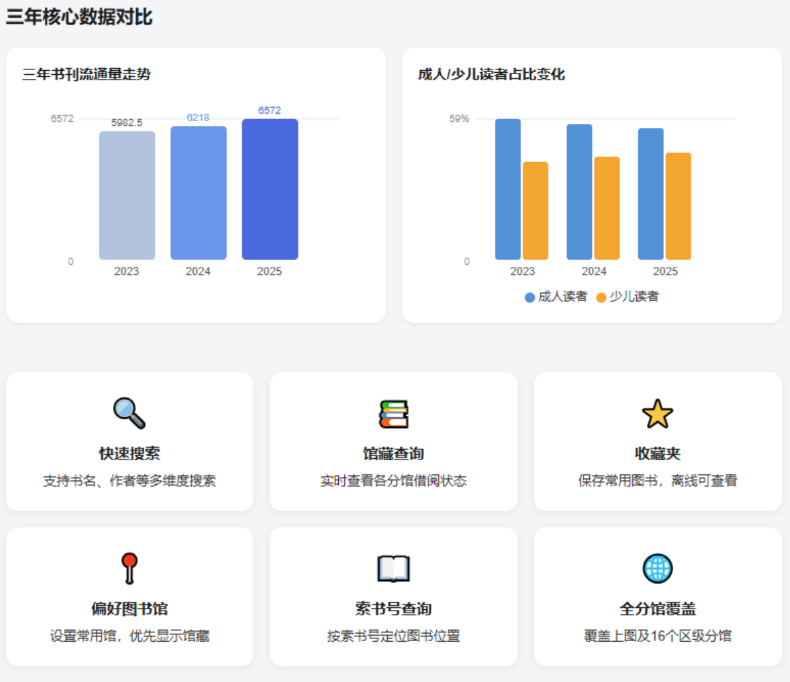
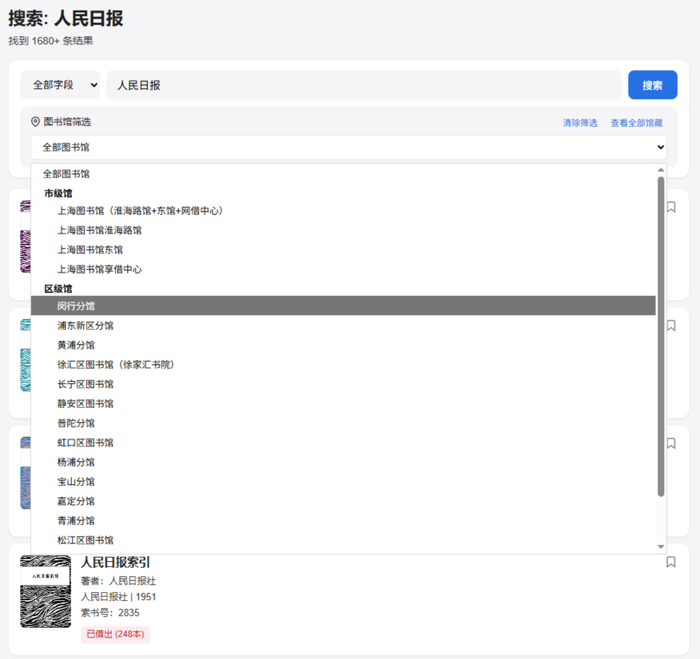
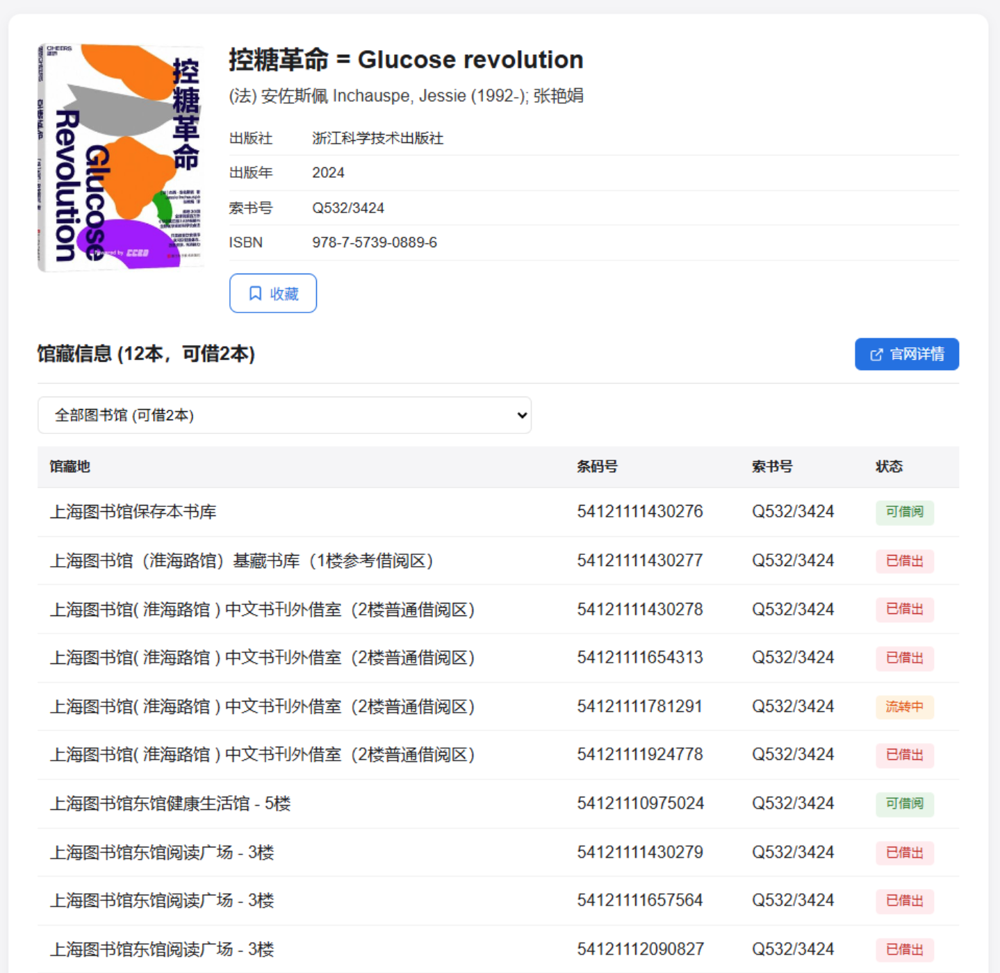
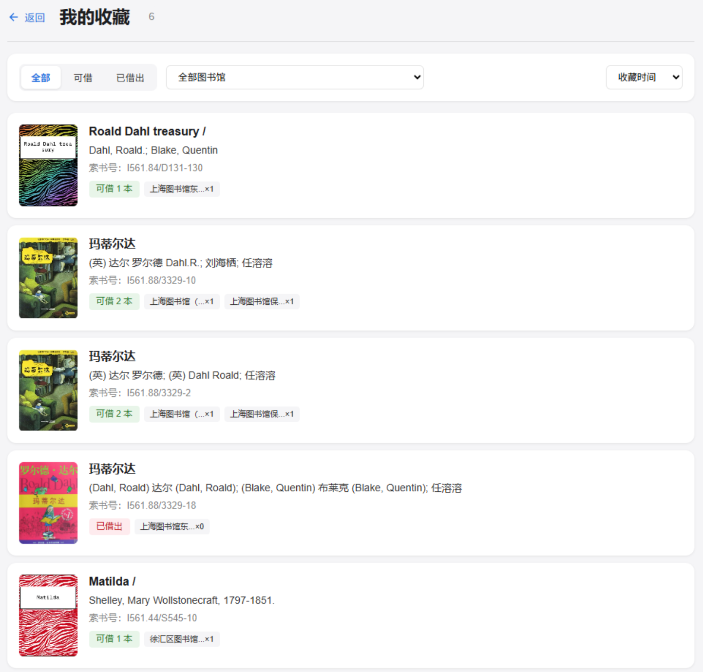

# 上海图书馆图书检索

基于上海图书馆 VuFind 系统的图书检索工具，提供 Web 版和桌面版两种使用方式。

## 截图预览

| 首页 | 借阅排行榜 |
|:---:|:---:|
|  |  |

| 阅读报告 | 按馆藏地搜索 |
|:---:|:---:|
|  |  |

| 图书详情与馆藏清单 | 收藏夹 |
|:---:|:---:|
|  |  |

## 功能亮点

- **图书检索** — 支持题名、作者、ISBN、索书号、出版社等多字段搜索，可按馆藏地筛选
- **图书详情** — 展示书目信息与完整馆藏清单，实时显示每本图书的可借/在馆/借出状态
- **借阅排行** — 成人榜/少儿榜，月度/年度，按中图法 22 类分类筛选
- **阅读报告** — 2023-2025 年度数据可视化（纯 SVG 渲染，零外部依赖）
- **搜索历史 & 收藏** — 本地持久化存储，桌面版使用 SQLite
- **自动更新** — 桌面版启动时检查 GitHub Releases 新版本
- **调试模式** — 桌面版 `--debug` 启动，开启控制台与 DevTools

## 两种使用方式

### Web 版（Cloudflare Workers）

在线部署，无需安装，浏览器直接访问。

```bash
# 本地开发
npm install
npm run dev

# 部署到 Cloudflare
npm run deploy
```

### 桌面版（Go + WebView2）

Windows 单文件 exe，双击即用，无需安装运行时。

从 [Releases](https://github.com/ZedeX/shanghai-library-book-search/releases/latest) 下载最新版，或自行构建：

```bash
cd desktop

# 安装依赖
go mod tidy

# 构建 Release 版（无控制台窗口）
go build -ldflags="-H windowsgui -s -w" -o shlib-desktop.exe .

# 构建 Debug 版（带控制台和 DevTools）
go build -o shlib-desktop-debug.exe .
```

运行 Debug 版：

```bash
shlib-desktop-debug.exe --debug
```

## 项目结构

```
├── src/                    # Web 后端 (TypeScript)
│   ├── index.ts            # Cloudflare Workers 入口 & 路由
│   ├── library-client.ts   # 上海图书馆 API 客户端
│   └── parser.ts           # HTML 解析器
├── public/                 # Web 前端 (HTML/CSS/JS)
│   ├── index.html          # 首页（阅读报告）
│   ├── search.html         # 搜索页
│   ├── record.html         # 图书详情页
│   ├── css/                # 样式
│   └── js/                 # 脚本
├── desktop/                # 桌面应用 (Go)
│   ├── frontend/           # 嵌入式前端 (单个 index.html)
│   ├── main.go             # 入口 + WebView2 窗口
│   ├── server.go           # 本地 HTTP 服务器 & API
│   ├── parser.go           # HTML 解析器（从 TS 移植）
│   ├── storage.go          # SQLite 存储（历史 + 收藏）
│   ├── updater.go          # GitHub 自动更新检查
│   ├── embed.go            # go:embed 指令
│   ├── icon.ico            # 应用图标
│   └── rsrc.syso           # Windows 资源文件（图标）
├── .github/workflows/      # GitHub Actions 自动构建发布
├── wrangler.toml           # Cloudflare Workers 配置
└── package.json
```

## 数据来源

- 图书检索：[上海图书馆 VuFind](https://vufind.library.sh.cn/) HTML 解析 + `/api/v1/search` JSON API
- 借阅排行：[上海图书馆官网](https://www.library.sh.cn) API（AAT Token 鉴权）
- 阅读报告：上海图书馆 2023-2025 年度官方阅读报告数据

## License

[Apache-2.0](LICENSE)
